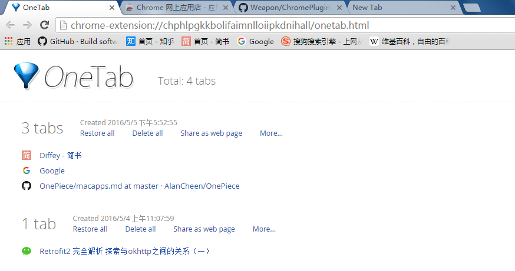
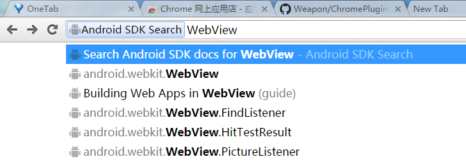
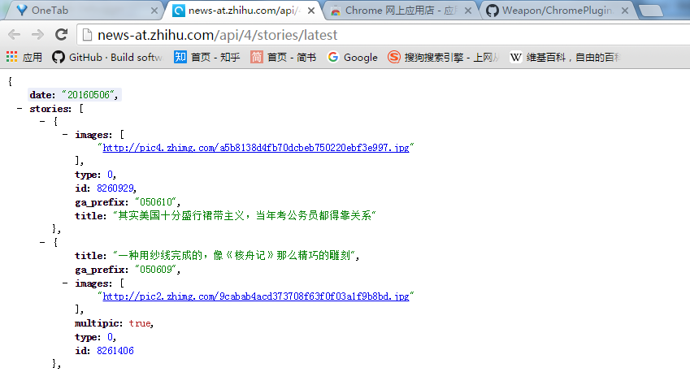

# Chrome插件
## [OneTab](https://chrome.google.com/webstore/detail/onetab/chphlpgkkbolifaimnlloiipkdnihall)

通常我都喜欢打开很多Tab却未必会立即全部看完，都这么在Chrome中开着非常占用内存。设想，如果有工具能组织这些Tab，想看时打开，不想看时关闭，看完后删除，就是真是太好了。OneTab就是这样一个工具，你值得拥有。

<b>推荐理由：</b>这是我用的最多的Chrome扩展。

## [Android SDK Search](https://chrome.google.com/webstore/detail/android-sdk-search/hgcbffeicehlpmgmnhnkjbjoldkfhoin)

Chrome地址栏中快速搜索Android SDK内容。
使用方法：地址栏输入ad敲空格，就可以搜索了。

<b>推荐理由：</b>快速查看Android SDK API

## [JsonView](https://chrome.google.com/webstore/detail/jsonview/chklaanhfefbnpoihckbnefhakgolnmc)

Chrome打开服务器接口，对于返回的json格式数据，JsonView会格式化。

<b>推荐理由：</b>查看Json数据的利器
